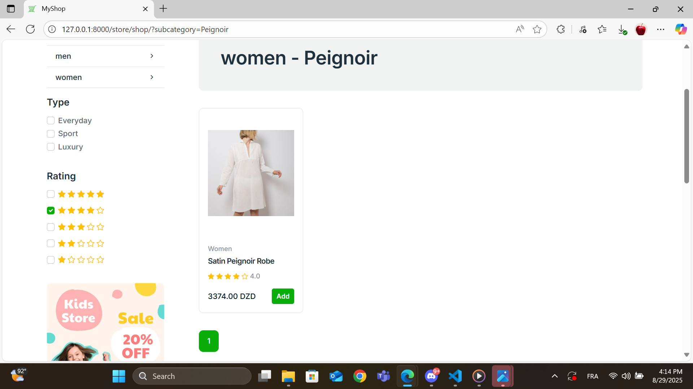
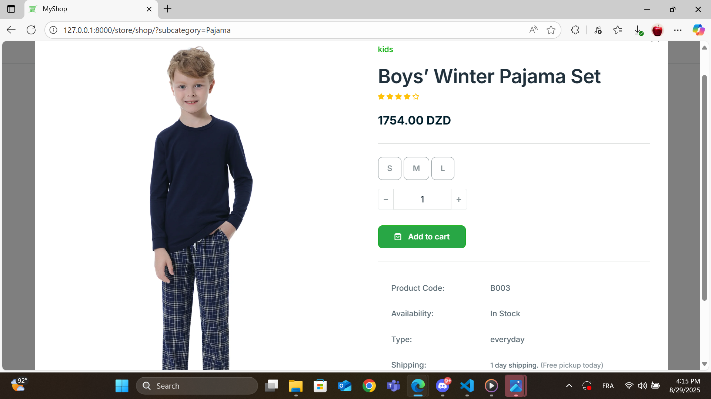
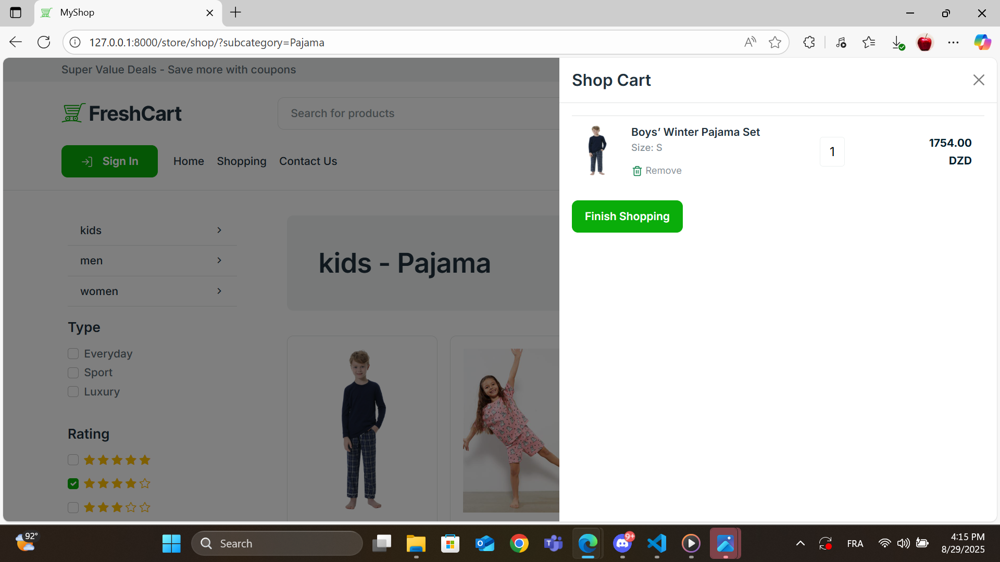
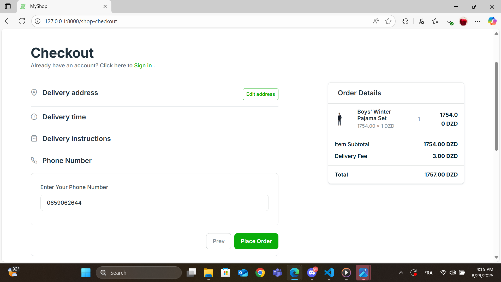
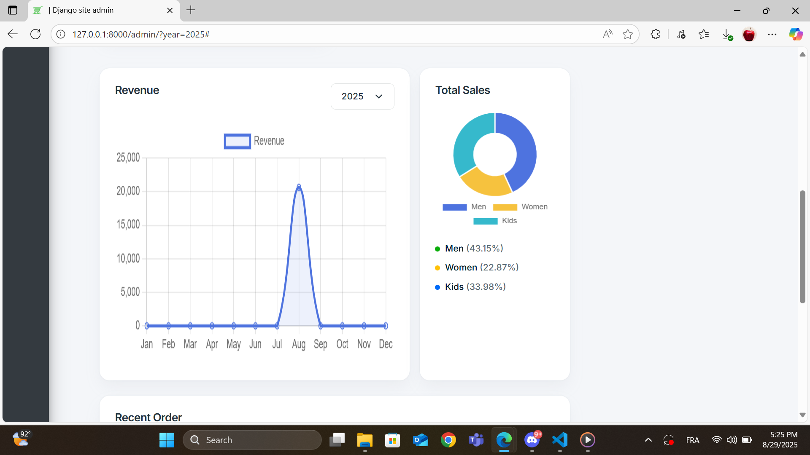

# 🛍️ E-commerce Store (Django + PostgreSQL)

A full-stack **Django web application** for an online underwear store.  
Users can browse products, add them to a cart, and complete checkout with delivery details.  
Both guests and registered users are supported.

## 🚀 Tech Stack
- **Backend:** Django, Python, PostgreSQL  
- **Frontend:** HTML, CSS, Bootstrap 
- **Database:** PostgreSQL  
- **Other:** AJAX, Django Admin  

## ✨ Features
- Browse products by **category and subcategory**.
- Product filtering by type (everyday, sport, luxury).
- Shopping cart (with **offcanvas sidebar**).
- Guest checkout with delivery details.
- Order creation with cart summary.
- Account settings and list of client orders.
- Admin panel for managing products, categories, and orders.

## 📸 Screenshots
Homepage:  


Product list:  


Product card:  


Cart sidebar:  


Checkout page:  


admin panel:  


## ⚙️ Installation & Setup
1. Clone the repository:
   ```bash
   git clone https://github.com/yourusername/ecommerce-store-django.git
   cd ecommerce-store-django
